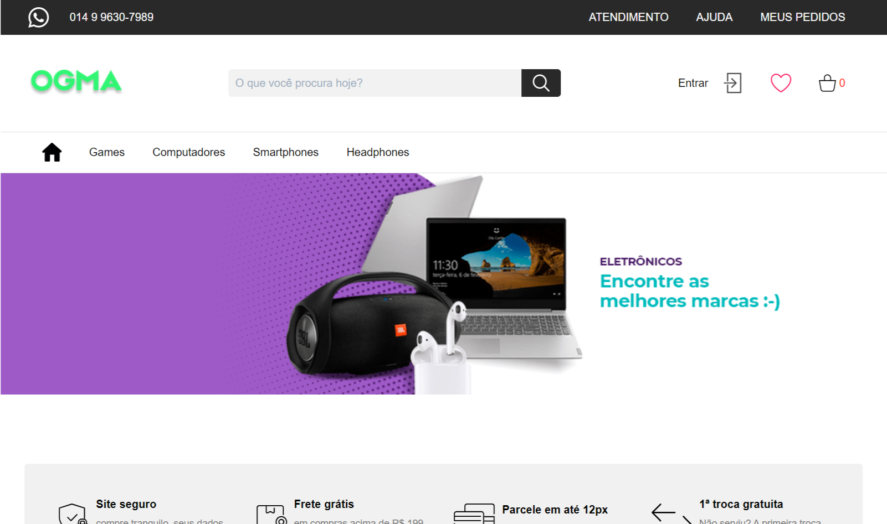

## #2 Desafio Hiring Coders #2

<b>Desafio</b> - Criação de um sistema e-commerce para inventário de produtos e dados de clientes.

## Sobre o projeto
Infelizmente devido a problemas pessoais e familiares não consegui acompanhar o treinamento durante essa semana (de 19/07 a 25/07), expliquei sobre isso nos Assignments sobre Times Ágeis e Liderança. Então fiz o máximo que consegui, de acordo com o tempo que tive. Fiz uma parte simples de cadastro do cliente, não tem segurança e nem validação, também criei uma parte do admin, página com todos os produtos e cadastro de produtos.
Faltou várias funcionalidades, aos poucos tentarei refatorar e vou adicionar o que faltou.

## Para ver/testar, acesse

[Ogma Store](https://ogma.vercel.app/)

Rota para testar o Admin

> https://ogma.vercel.app/dashboard/login

## Tecnologias**

 
  
  
   
  

